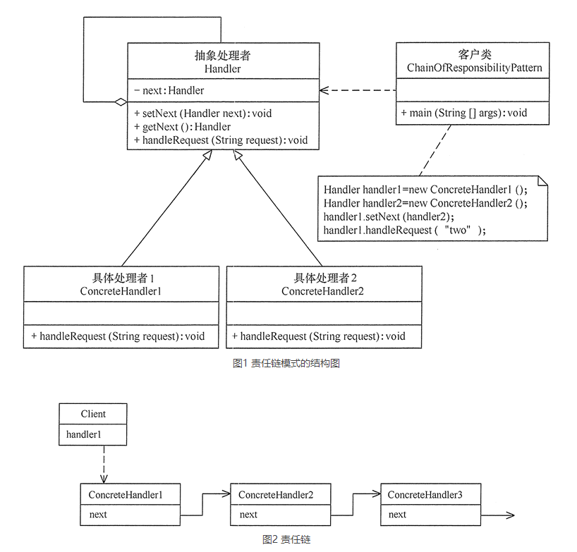

# 责任链模式（Chain of Responsibility）

## 定义
责任链模式：为了避免请求发送者与多个请求处理者耦合在一起，于是将所有请求的处理者通过前一对象记住其下一个对象的引用而连成一条链；当有请求发生时，可将请求沿着这条链传递，直到有对象处理它为止。

注意：责任链模式也叫职责链模式。

## 优点
- 降低了对象之间的耦合度。该模式使得一个对象无须知道到底是哪一个对象处理其请求以及链的结构，发送者和接收者也无须拥有对方的明确信息。
- 增强了系统的可扩展性。可以根据需要增加新的请求处理类，满足开闭原则。
- 增强了给对象指派职责的灵活性。当工作流程发生变化，可以动态地改变链内的成员或者调动它们的次序，也可动态地新增或者删除责任。
- 责任链简化了对象之间的连接。每个对象只需保持一个指向其后继者的引用，不需保持其他所有处理者的引用，这避免了使用众多的 if 或者 if···else 语句。
- 责任分担。每个类只需要处理自己该处理的工作，不该处理的传递给下一个对象完成，明确各类的责任范围，符合类的单一职责原则。

## 缺点
- 不能保证每个请求一定被处理。由于一个请求没有明确的接收者，所以不能保证它一定会被处理，该请求可能一直传到链的末端都得不到处理。
- 对比较长的职责链，请求的处理可能涉及多个处理对象，系统性能将受到一定影响。
- 职责链建立的合理性要靠客户端来保证，增加了客户端的复杂性，可能会由于职责链的错误设置而导致系统出错，如可能会造成循环调用。

## 应用场景
- 多个对象可以处理一个请求，但具体由哪个对象处理该请求在运行时自动确定。
- 可动态指定一组对象处理请求，或添加新的处理者。
- 需要在不明确指定请求处理者的情况下，向多个处理者中的一个提交请求。

## 总结
通常情况下，可以通过数据链表来实现职责链模式的数据结构。

职责链模式主要包含以下角色。
- 抽象处理者（Handler）角色：定义一个处理请求的接口，包含抽象处理方法和一个后继连接。
- 具体处理者（Concrete Handler）角色：实现抽象处理者的处理方法，判断能否处理本次请求，如果可以处理请求则处理，否则将该请求转给它的后继者。
- 客户类（Client）角色：创建处理链，并向链头的具体处理者对象提交请求，它不关心处理细节和请求的传递过程。

责任链模式的本质是解耦请求与处理，让请求在处理链中能进行传递与被处理；理解责任链模式应当理解其模式，而不是其具体实现。责任链模式的独到之处是将其节点处理者组合成了链式结构，并允许节点自身决定是否进行请求处理或转发，相当于让请求流动起来。

职责链模式存在以下两种情况。
- 纯的职责链模式：一个请求必须被某一个处理者对象所接收，且一个具体处理者对某个请求的处理只能采用以下两种行为之一：自己处理（承担责任）；把责任推给下家处理。
- 不纯的职责链模式：允许出现某一个具体处理者对象在承担了请求的一部分责任后又将剩余的责任传给下家的情况，且一个请求可以最终不被任何接收端对象所接收。

