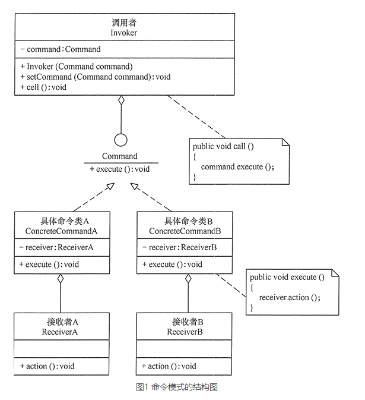

# 命令模式（COMMAND）

## 定义
命令模式：将一个请求封装为一个对象，使发出请求的责任和执行请求的责任分割开。这样两者之间通过命令对象进行沟通，这样方便将命令对象进行储存、传递、调用、增加与管理。

## 优点
- 通过引入中间件（抽象接口）降低系统的耦合度。
- 扩展性良好，增加或删除命令非常方便。采用命令模式增加与删除命令不会影响其他类，且满足“开闭原则”。
- 可以实现宏命令。命令模式可以与组合模式结合，将多个命令装配成一个组合命令，即宏命令。
- 方便实现 Undo 和 Redo 操作。命令模式可以与后面介绍的备忘录模式结合，实现命令的撤销与恢复。
- 可以在现有命令的基础上，增加额外功能。比如日志记录，结合装饰器模式会更加灵活。

## 缺点
- 可能产生大量具体的命令类。因为每一个具体操作都需要设计一个具体命令类，这会增加系统的复杂性。
- 命令模式的结果其实就是接收方的执行结果，但是为了以命令的形式进行架构、解耦请求与实现，引入了额外类型结构（引入了请求方与抽象命令接口），增加了理解上的困难。不过这也是设计模式的通病，抽象必然会额外增加类的数量，代码抽离肯定比代码聚合更加难理解。

## 应用场景
当系统的某项操作具备命令语义，且命令实现不稳定（变化）时，可以通过命令模式解耦请求与实现。使用抽象命令接口使请求方的代码架构稳定，封装接收方具体命令的实现细节。接收方与抽象命令呈现弱耦合（内部方法无需一致），具备良好的扩展性。

命令模式通常适用于以下场景。
- 请求调用者需要与请求接收者解耦时，命令模式可以使调用者和接收者不直接交互。
- 系统随机请求命令或经常增加、删除命令时，命令模式可以方便地实现这些功能。
- 当系统需要执行一组操作时，命令模式可以定义宏命令来实现该功能。
- 当系统需要支持命令的撤销（Undo）操作和恢复（Redo）操作时，可以将命令对象存储起来，采用备忘录模式来实现。

## 总结
命令模式包含如下角色：
- Command: 抽象命令接口类
- ConcreteCommand: 具体命令实现类
- Invoker: 命令发送者
- Receiver: 命令接收者（执行者）

- 在命令模式中，将一个请求封装为一个对象，从而使我们可用不同的请求对客户进行参数化；对请求排队或者记录请求日志，以及支持可撤销的操作。命令模式是一种对象行为型模式，其别名为动作模式或事务模式。
- 命令模式包含四个角色：抽象命令类中声明了用于执行请求的execute()等方法，通过这些方法可以调用请求接收者的相关操作；具体命令类是抽象命令类的子类，实现了在抽象命令类中声明的方法，它对应具体的接收者对象，将接收者对象的动作绑定其中；调用者即请求的发送者，又称为请求者，它通过命令对象来执行请求；接收者执行与请求相关的操作，它具体实现对请求的业务处理。
- 命令模式的本质是对命令进行封装，将发出命令的责任和执行命令的责任分割开。命令模式使请求本身成为一个对象，这个对象和其他对象一样可以被存储和传递。
- 命令模式的主要优点在于降低系统的耦合度，增加新的命令很方便，而且可以比较容易地设计一个命令队列和宏命令，并方便地实现对请求的撤销和恢复；其主要缺点在于可能会导致某些系统有过多的具体命令类。
- 命令模式适用情况包括：需要将请求调用者和请求接收者解耦，使得调用者和接收者不直接交互；需要在不同的时间指定请求、将请求排队和执行请求；需要支持命令的撤销操作和恢复操作，需要将一组操作组合在一起，即支持宏命令。

