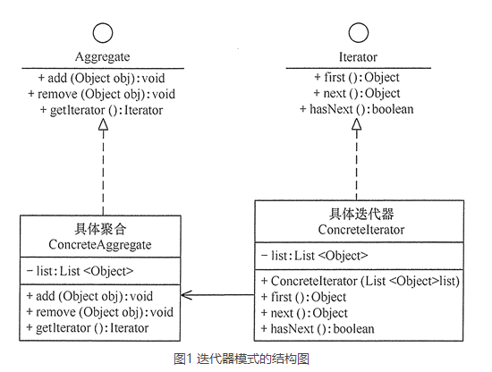

# 迭代器模式（Iterator）

## 定义
迭代器模式：提供一个对象来顺序访问聚合对象中的一系列数据，而不暴露聚合对象的内部表示。

## 优点
迭代器模式是一种对象行为型模式，其主要优点如下。
- 访问一个聚合对象的内容而无须暴露它的内部表示。
- 遍历任务交由迭代器完成，这简化了聚合类。
- 它支持以不同方式遍历一个聚合，甚至可以自定义迭代器的子类以支持新的遍历。
- 增加新的聚合类和迭代器类都很方便，无须修改原有代码。
- 封装性良好，为遍历不同的聚合结构提供一个统一的接口。

## 缺点
- 增加了类的个数，这在一定程度上增加了系统的复杂性。

## 应用场景
- 当需要为聚合对象提供多种遍历方式时。
- 当需要为遍历不同的聚合结构提供一个统一的接口时。
- 当访问一个聚合对象的内容而无须暴露其内部细节的表示时。

由于聚合与迭代器的关系非常密切，所以大多数语言在实现聚合类时都提供了迭代器类，因此大数情况下使用语言中已有的聚合类的迭代器就已经够了。

## 总结
迭代器模式是通过将聚合对象的遍历行为分离出来，抽象成迭代器类来实现的，其目的是在不暴露聚合对象的内部结构的情况下，让外部代码透明地访问聚合的内部数据。现在我们来分析其基本结构与实现方法。

迭代器模式主要包含以下角色：
- 抽象聚合（Aggregate）角色：定义存储、添加、删除聚合对象以及创建迭代器对象的接口。
- 具体聚合（ConcreteAggregate）角色：实现抽象聚合类，返回一个具体迭代器的实例。
- 抽象迭代器（Iterator）角色：定义访问和遍历聚合元素的接口，通常包含 hasNext()、first()、next() 等方法。
- 具体迭代器（Concretelterator）角色：实现抽象迭代器接口中所定义的方法，完成对聚合对象的遍历，记录遍历的当前位置。

