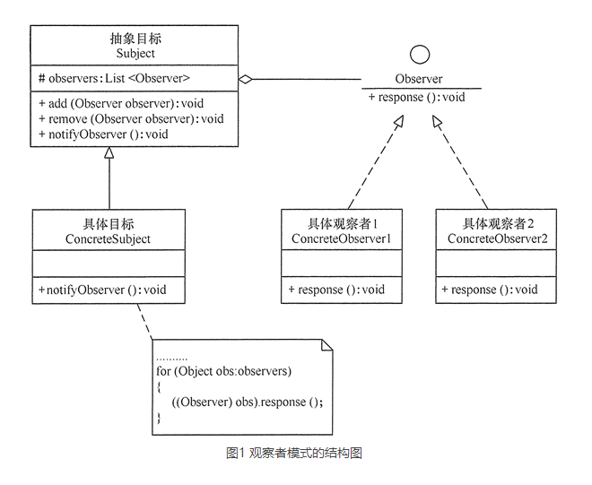

# 观察者模式（Observer）

## 定义
观察者模式：指多个对象间存在一对多的依赖关系，当一个对象的状态发生改变时，所有依赖于它的对象都得到通知并被自动更新。这种模式有时又称作发布-订阅模式、模型-视图模式，它是对象行为型模式。

## 优点
- 降低了目标与观察者之间的耦合关系，两者之间是抽象耦合关系。符合依赖倒置原则。
- 目标与观察者之间建立了一套触发机制。

## 缺点
- 目标与观察者之间的依赖关系并没有完全解除，而且有可能出现循环引用。
- 当观察者对象很多时，通知的发布会花费很多时间，影响程序的效率。

## 应用场景
在软件系统中，当系统一方行为依赖另一方行为的变动时，可使用观察者模式松耦合联动双方，使得一方的变动可以通知到感兴趣的另一方对象，从而让另一方对象对此做出响应。

观察者模式适合以下几种情形。
- 对象间存在一对多关系，一个对象的状态发生改变会影响其他对象。
- 当一个抽象模型有两个方面，其中一个方面依赖于另一方面时，可将这二者封装在独立的对象中以使它们可以各自独立地改变和复用。
- 实现类似广播机制的功能，不需要知道具体收听者，只需分发广播，系统中感兴趣的对象会自动接收该广播。
- 多层级嵌套使用，形成一种链式触发机制，使得事件具备跨域（跨越两种观察者类型）通知。

## 总结
实现观察者模式时要注意具体目标对象和具体观察者对象之间不能直接调用，否则将使两者之间紧密耦合起来，这违反了面向对象的设计原则。

观察者模式的主要角色如下:
- 抽象主题（Subject）角色：也叫抽象目标类，它提供了一个用于保存观察者对象的聚集类和增加、删除观察者对象的方法，以及通知所有观察者的抽象方法。
- 具体主题（Concrete Subject）角色：也叫具体目标类，它实现抽象目标中的通知方法，当具体主题的内部状态发生改变时，通知所有注册过的观察者对象。
- 抽象观察者（Observer）角色：它是一个抽象类或接口，它包含了一个更新自己的抽象方法，当接到具体主题的更改通知时被调用。
- 具体观察者（Concrete Observer）角色：实现抽象观察者中定义的抽象方法，以便在得到目标的更改通知时更新自身的状态。

- 观察者模式定义对象间的一种一对多依赖关系，使得每当一个对象状态发生改变时，其相关依赖对象皆得到通知并被自动更新。观察者模式又叫做发布-订阅模式、模型-视图模式、源-监听器模式或从属者模式。观察者模式是一种对象行为型模式。
- 观察者模式包含四个角色：目标又称为主题，它是指被观察的对象；具体目标是目标类的子类，通常它包含有经常发生改变的数据，当它的状态发生改变时，向它的各个观察者发出通知；观察者将对观察目标的改变做出反应；在具体观察者中维护一个指向具体目标对象的引用，它存储具体观察者的有关状态，这些状态需要和具体目标的状态保持一致。
- 观察者模式定义了一种一对多的依赖关系，让多个观察者对象同时监听某一个目标对象，当这个目标对象的状态发生变化时，会通知所有观察者对象，使它们能够自动更新。
观察者模式的主要优点在于可以实现表示层和数据逻辑层的分离，并在观察目标和观察者之间建立一个抽象的耦合，支持广播通信；其主要缺点在于如果一个观察目标对象有很多直接和间接的观察者的话，将所有的观察者都通知到会花费很多时间，而且如果在观察者和观察目标之间有循环依赖的话，观察目标会触发它们之间进行循环调用，可能导致系统崩溃。
- 观察者模式适用情况包括：一个抽象模型有两个方面，其中一个方面依赖于另一个方面；一个对象的改变将导致其他一个或多个对象也发生改变，而不知道具体有多少对象将发生改变；一个对象必须通知其他对象，而并不知道这些对象是谁；需要在系统中创建一个触发链。

