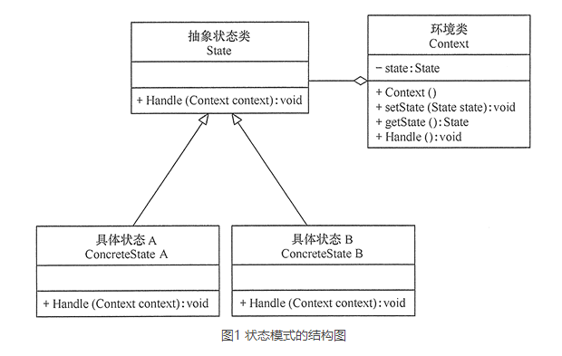

# 状态模式（State）

## 定义
状态模式：对有状态的对象，把复杂的“判断逻辑”提取到不同的状态对象中，允许状态对象在其内部状态发生改变时改变其行为。

## 优点
- 结构清晰，状态模式将与特定状态相关的行为局部化到一个状态中，并且将不同状态的行为分割开来，满足“单一职责原则”。
- 将状态转换显示化，减少对象间的相互依赖。将不同的状态引入独立的对象中会使得状态转换变得更加明确，且减少对象间的相互依赖。
- 状态类职责明确，有利于程序的扩展。通过定义新的子类很容易地增加新的状态和转换。

## 缺点
- 状态模式的使用必然会增加系统的类与对象的个数。
- 状态模式的结构与实现都较为复杂，如果使用不当会导致程序结构和代码的混乱。
- 状态模式对开闭原则的支持并不太好，对于可以切换状态的状态模式，增加新的状态类需要修改那些负责状态转换的源码，否则无法切换到新增状态，而且修改某个状态类的行为也需要修改对应类的源码。

## 应用场景
- 当一个对象的行为取决于它的状态，并且它必须在运行时根据状态改变它的行为时，就可以考虑使用状态模式。
- 一个操作中含有庞大的分支结构，并且这些分支决定于对象的状态时。

## 总结
在软件开发过程中，应用程序中的部分对象可能会根据不同的情况做出不同的行为，我们把这种对象称为有状态的对象，而把影响对象行为的一个或多个动态变化的属性称为状态。当有状态的对象与外部事件产生互动时，其内部状态就会发生改变，从而使其行为也发生改变。如人都有高兴和伤心的时候，不同的情绪有不同的行为，当然外界也会影响其情绪变化。

对这种有状态的对象编程，传统的解决方案是：将这些所有可能发生的情况全都考虑到，然后使用 if-else 或 switch-case 语句来做状态判断，再进行不同情况的处理。但是显然这种做法对复杂的状态判断存在天然弊端，条件判断语句会过于臃肿，可读性差，且不具备扩展性，维护难度也大。且增加新的状态时要添加新的 if-else 语句，这违背了“开闭原则”，不利于程序的扩展。

以上问题如果采用“状态模式”就能很好地得到解决。状态模式的解决思想是：当控制一个对象状态转换的条件表达式过于复杂时，把相关“判断逻辑”提取出来，用各个不同的类进行表示，系统处于哪种情况，直接使用相应的状态类对象进行处理，这样能把原来复杂的逻辑判断简单化，消除了 if-else、switch-case 等冗余语句，代码更有层次性，并且具备良好的扩展力。

状态模式把受环境改变的对象行为包装在不同的状态对象里，其意图是让一个对象在其内部状态改变的时候，其行为也随之改变。现在我们来分析其基本结构和实现方法。

状态模式包含以下主要角色。
- 环境类（Context）角色：也称为上下文，它定义了客户端需要的接口，内部维护一个当前状态，并负责具体状态的切换。
- 抽象状态（State）角色：定义一个接口，用以封装环境对象中的特定状态所对应的行为，可以有一个或多个行为。
- 具体状态（Concrete State）角色：实现抽象状态所对应的行为，并且在需要的情况下进行状态切换。

### 状态模式与责任链模式的区别
状态模式和责任链模式都能消除 if-else 分支过多的问题。但在某些情况下，状态模式中的状态可以理解为责任，那么在这种情况下，两种模式都可以使用。

从定义来看，状态模式强调的是一个对象内在状态的改变，而责任链模式强调的是外部节点对象间的改变。

从代码实现上来看，两者最大的区别就是状态模式的各个状态对象知道自己要进入的下一个状态对象，而责任链模式并不清楚其下一个节点处理对象，因为链式组装由客户端负责。
### 状态模式与策略模式的区别
状态模式和策略模式的 UML 类图架构几乎完全一样，但两者的应用场景是不一样的。策略模式的多种算法行为择其一都能满足，彼此之间是独立的，用户可自行更换策略算法，而状态模式的各个状态间存在相互关系，彼此之间在一定条件下存在自动切换状态的效果，并且用户无法指定状态，只能设置初始状态。

