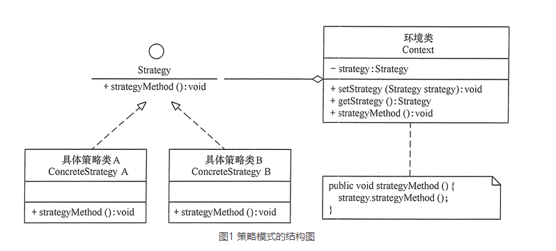

# 策略模式（STRATEGY）

STRATEGY模式使用委托来倒置通用算法和具体实现之间的依赖关系，STRATEGY模式比TEMPLATE METHOD模式涉及更多数量的类和间接层次，
指针的使用比继承多一点运行时间和数据空间开销。

但同时STRATEGY模式也允许具体实现细节独立于高层的算法重用：IntSortHandle对BubbleSorter一无所知，它不依赖于冒泡排序的任何实现方式，
而TEMPLATE METHOD模式中，IntBubbleSorter直接依赖于BubbleSorter，而BubbleSorter中包含着冒泡排序算法。IntSortHandle可以非常方便的被其它算法复用。

TEMPLATE METHOD模式和STRATEGY模式都可以用来分离高层的算法和低层的具体实现细节。都允许高层的算法独立于它的具体实现细节重用。此外，STRATEGY模式也允许具体实现细节独立于高层的算法重用，不过要以一些额外的复杂性、内存以及运行时间开销作为代价。