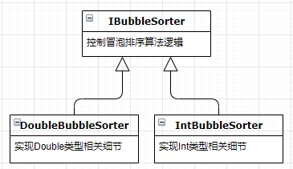

# 模板方法模式（TEMPLATE METHOD）

## 定义
模板方法模式：定义一个操作中的算法骨架，而将算法的一些步骤延迟到子类中，使得子类可以不改变该算法结构的情况下重定义该算法的某些特定步骤。它是一种类行为型模式。

## 优点
- 它封装了不变部分，扩展可变部分。它把认为是不变部分的算法封装到父类中实现，而把可变部分算法由子类继承实现，便于子类继续扩展。
- 它在父类中提取了公共的部分代码，便于代码复用。
- 部分方法是由子类实现的，因此子类可以通过扩展方式增加相应的功能，符合开闭原则。

## 缺点
- 对每个不同的实现都需要定义一个子类，这会导致类的个数增加，系统更加庞大，设计也更加抽象，间接地增加了系统实现的复杂度。
- 父类中的抽象方法由子类实现，子类执行的结果会影响父类的结果，这导致一种反向的控制结构，它提高了代码阅读的难度。
- 由于继承关系自身的缺点，如果父类添加新的抽象方法，则所有子类都要改一遍。

## 总结
TEMPLATE METHOD模式展示了面向对象编程中诸多经典重用形式中的一种。其中通用算法被放置在基类中，并且通过继承在不同的具体上下文中实现该通用算法。基类控制算法，子类实现细节的方式符合“开闭原则”。提高了代码复用性和可扩展性。但是这项技术是有代价的，继承是一种非常强的关系。派生类不可避免地要和它们的基类绑定在一起。

就像TEMPLATE METHOD中的例子一样，IntBubbleSorter和IBubbleSorter绑定在了一起，如果后面再有其它排序类也需要outOfOrder和swap功能，就不太好复用。

TEMPLATE METHOD模式属于类行为模式，根据“合成复用原则”，系统中要尽量使用关联关系来取代继承关系，因此STRATEGY模式提供了另一种可选方案。

TEMPLATE METHOD模式和STRATEGY模式所要解决的问题是类似的，而且常常可以互换使用。不过，TEMPLATE METHOD模式使用继承来解决问题，而STRATEGY模式使用的则是委托。

TEMPLATE METHOD模式和STRATEGY模式都可以用来分离高层的算法和低层的具体实现细节。都允许高层的算法独立于它的具体实现细节重用。此外，STRATEGY模式也允许具体实现细节独立于高层的算法重用，不过要以一些额外的复杂性、内存以及运行时间开销作为代价。

