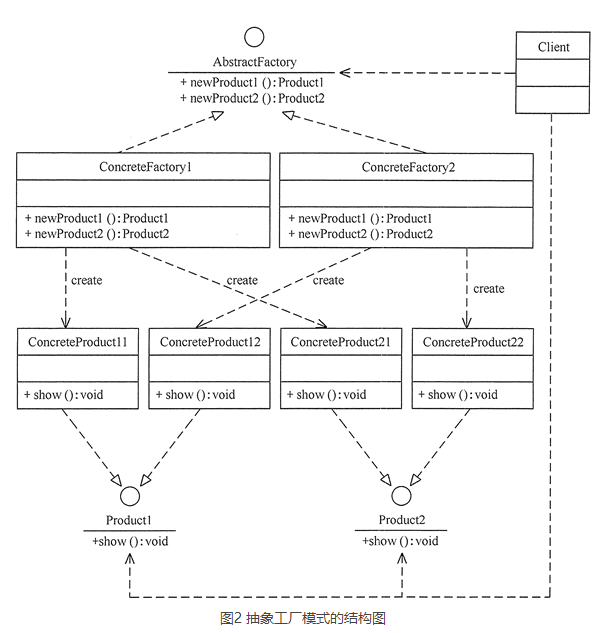

# 抽象工厂模式（AbstractFactory）

## 定义
抽象工厂模式定义：是一种为访问类提供一个创建一组相关或相互依赖对象的接口，且访问类无须指定所要产品的具体类就能得到同族的不同等级的产品的模式结构。

## 优点
- 可以在类的内部对产品族中相关联的多等级产品共同管理，而不必专门引入多个新的类来进行管理。
- 当需要产品族时，抽象工厂可以保证客户端始终只使用同一个产品的产品组。
- 抽象工厂增强了程序的可扩展性，当增加一个新的产品族时，不需要修改原代码，满足开闭原则

## 缺点
- 当产品族中需要增加一个新的产品时，所有的工厂类都需要进行修改。增加了系统的抽象性和理解难度。

## 应用场景
系统中有多个产品族，每个具体工厂创建同一族但属于不同等级结构的产品。
系统一次只可能消费其中某一族产品，即同族的产品一起使用。

- 当需要创建的对象是一系列相互关联或相互依赖的产品族时，如电器工厂中的电视机、洗衣机、空调等。
- 系统中有多个产品族，但每次只使用其中的某一族产品。如有人只喜欢穿某一个品牌的衣服和鞋。
- 系统中提供了产品的类库，且所有产品的接口相同，客户端不依赖产品实例的创建细节和内部结构。

## 总结
抽象工厂模式是工厂方法模式的升级版本，工厂方法模式只生产一个等级的产品，而抽象工厂模式可生产多个等级的产品。
当系统中只存在一个等级结构的产品时，抽象工厂模式将退化到工厂方法模式。

在工厂方法模式中具体工厂负责生产具体的产品，每一个具体工厂对应一种具体产品，工厂方法也具有唯一性，一般情况下，一个具体工厂中只有一个工厂方法或者一组重载的工厂方法。但是有时候我们需要一个工厂可以提供多个产品对象，而不是单一的产品对象。

为了更清晰地理解工厂方法模式，需要先引入两个概念：
- 产品等级结构 ：产品等级结构即产品的继承结构，如一个抽象类是电视机，其子类有海尔电视机、海信电视机、TCL电视机，则抽象电视机与具体品牌的电视机之间构成了一个产品等级结构，抽象电视机是父类，而具体品牌的电视机是其子类。
- 产品族 ：在抽象工厂模式中，产品族是指由同一个工厂生产的，位于不同产品等级结构中的一组产品，如海尔电器工厂生产的海尔电视机、海尔电冰箱，海尔电视机位于电视机产品等级结构中，海尔电冰箱位于电冰箱产品等级结构中。
当系统所提供的工厂所需生产的具体产品并不是一个简单的对象，而是多个位于不同产品等级结构中属于不同类型的具体产品时需要使用抽象工厂模式。

抽象工厂模式是所有形式的工厂模式中最为抽象和最具一般性的一种形态。

抽象工厂模式与工厂方法模式最大的区别在于，工厂方法模式针对的是一个产品等级结构，而抽象工厂模式则需要面对多个产品等级结构，一个工厂等级结构可以负责多个不同产品等级结构中的产品对象的创建 。当一个工厂等级结构可以创建出分属于不同产品等级结构的一个产品族中的所有对象时，抽象工厂模式比工厂方法模式更为简单、有效率。

抽象工厂模式同工厂方法模式一样，也是由抽象工厂、具体工厂、抽象产品和具体产品等 4 个要素构成，但抽象工厂中方法个数不同，抽象产品的个数也不同。现在我们
- 抽象工厂（Abstract Factory）：提供了创建产品的接口，它包含多个创建产品的方法 newProduct()，可以创建多个不同等级的产品。
- 具体工厂（Concrete Factory）：主要是实现抽象工厂中的多个抽象方法，完成具体产品的创建。
- 抽象产品（Product）：定义了产品的规范，描述了产品的主要特性和功能，抽象工厂模式有多个抽象产品。
- 具体产品（ConcreteProduct）：实现了抽象产品角色所定义的接口，由具体工厂来创建，它同具体工厂之间是多对一的关系。

抽象工厂模式的扩展有一定的“开闭原则”倾斜性：
- 当增加一个新的产品族时只需增加一个新的具体工厂，不需要修改原代码，满足开闭原则。
- 当产品族中需要增加一个新种类的产品时，则所有的工厂类都需要进行修改，不满足开闭原则。

简单总结：
- 抽象工厂模式提供一个创建一系列相关或相互依赖对象的接口，而无须指定它们具体的类。抽象工厂模式又称为Kit模式，属于对象创建型模式。
- 抽象工厂模式包含四个角色：抽象工厂用于声明生成抽象产品的方法；具体工厂实现了抽象工厂声明的生成抽象产品的方法，生成一组具体产品，这些产品构成了一个产品族，每一个产品都位于某个产品等级结构中；抽象产品为每种产品声明接口，在抽象产品中定义了产品的抽象业务方法；具体产品定义具体工厂生产的具体产品对象，实现抽象产品接口中定义的业务方法。
- 抽象工厂模式是所有形式的工厂模式中最为抽象和最具一般性的一种形态。抽象工厂模式与工厂方法模式最大的区别在于，工厂方法模式针对的是一个产品等级结构，而抽象工厂模式则需要面对多个产品等级结构。
- 抽象工厂模式的主要优点是隔离了具体类的生成，使得客户并不需要知道什么被创建，而且每次可以通过具体工厂类创建一个产品族中的多个对象，增加或者替换产品族比较方便，增加新的具体工厂和产品族很方便；主要缺点在于增加新的产品等级结构很复杂，需要修改抽象工厂和所有的具体工厂类，对“开闭原则”的支持呈现倾斜性。
- 抽象工厂模式适用情况包括：一个系统不应当依赖于产品类实例如何被创建、组合和表达的细节；系统中有多于一个的产品族，而每次只使用其中某一产品族；属于同一个产品族的产品将在一起使用；系统提供一个产品类的库，所有的产品以同样的接口出现，从而使客户端不依赖于具体实现。

