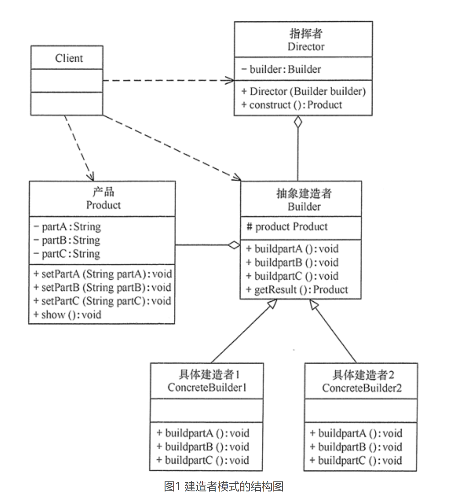

# 建造者模式（Builder）

## 定义
建造者模式的定义：指将一个复杂对象的构造与它的表示分离，使同样的构建过程可以创建不同的表示，这样的设计模式被称为建造者模式。它是将一个复杂的对象分解为多个简单的对象，然后一步一步构建而成。它将变与不变相分离，即产品的组成部分是不变的，但每一部分是可以灵活选择的。

## 优点
- 封装性好，构建和表示分离。
- 扩展性好，各个具体的建造者相互独立，有利于系统的解耦。
- 客户端不必知道产品内部组成的细节，建造者可以对创建过程逐步细化，而不对其它模块产生任何影响，便于控制细节风险。

## 缺点
- 产品的组成部分必须相同，这限制了其使用范围。
- 如果产品的内部变化复杂，如果产品内部发生变化，则建造者也要同步修改，后期维护成本较大。

## 应用场景
建造者模式唯一区别于工厂模式的是针对复杂对象的创建。也就是说，如果创建简单对象，通常都是使用工厂模式进行创建，而如果创建复杂对象，就可以考虑使用建造者模式。

当需要创建的产品具备复杂创建过程时，可以抽取出共性创建过程，然后交由具体实现类自定义创建流程，使得同样的创建行为可以生产出不同的产品，分离了创建与表示，使创建产品的灵活性大大增加。

建造者模式主要适用于以下应用场景：
- 相同的方法，不同的执行顺序，产生不同的结果。
- 多个部件或零件，都可以装配到一个对象中，但是产生的结果又不相同。
- 产品类非常复杂，或者产品类中不同的调用顺序产生不同的作用。
- 初始化一个对象特别复杂，参数多，而且很多参数都具有默认值。

## 总结
建造者模式是一步一步创建一个复杂的对象，它允许用户只通过指定复杂对象的类型和内容就可以构建它们，用户不需要知道内部的具体构建细节。建造者模式属于对象创建型模式。根据中文翻译的不同，建造者模式又可以称为生成器模式。

建造者（Builder）模式的主要角色如下。
- 产品角色（Product）：它是包含多个组成部件的复杂对象，由具体建造者来创建其各个零部件。
- 抽象建造者（Builder）：它是一个包含创建产品各个子部件的抽象方法的接口，通常还包含一个返回复杂产品的方法 getResult()。
- 具体建造者(Concrete Builder）：实现 Builder 接口，完成复杂产品的各个部件的具体创建方法。
- 指挥者（Director）：它调用建造者对象中的部件构造与装配方法完成复杂对象的创建，在指挥者中不涉及具体产品的信息。

建造者（Builder）模式在应用过程中可以根据需要改变，如果创建的产品种类只有一种，只需要一个具体建造者，这时可以省略掉抽象建造者，甚至可以省略掉指挥者角色。

简单总结：
- 建造者模式将一个复杂对象的构建与它的表示分离，使得同样的构建过程可以创建不同的表示。建造者模式是一步一步创建一个复杂的对象，它允许用户只通过指定复杂对象的类型和内容就可以构建它们，用户不需要知道内部的具体构建细节。建造者模式属于对象创建型模式。
- 建造者模式包含如下四个角色：抽象建造者为创建一个产品对象的各个部件指定抽象接口；具体建造者实现了抽象建造者接口，实现各个部件的构造和装配方法，定义并明确它所创建的复杂对象，也可以提供一个方法返回创建好的复杂产品对象；产品角色是被构建的复杂对象，包含多个组成部件；指挥者负责安排复杂对象的建造次序，指挥者与抽象建造者之间存在关联关系，可以在其construct()建造方法中调用建造者对象的部件构造与装配方法，完成复杂对象的建造
- 在建造者模式的结构中引入了一个指挥者类，该类的作用主要有两个：一方面它隔离了客户与生产过程；另一方面它负责控制产品的生成过程。指挥者针对抽象建造者编程，客户端只需要知道具体建造者的类型，即可通过指挥者类调用建造者的相关方法，返回一个完整的产品对象。
- 建造者模式的主要优点在于客户端不必知道产品内部组成的细节，将产品本身与产品的创建过程解耦，使得相同的创建过程可以创建不同的产品对象，每一个具体建造者都相对独立，而与其他的具体建造者无关，因此可以很方便地替换具体建造者或增加新的具体建造者，符合“开闭原则”，还可以更加精细地控制产品的创建过程；其主要缺点在于由于建造者模式所创建的产品一般具有较多的共同点，其组成部分相似，因此其使用范围受到一定的限制，如果产品的内部变化复杂，可能会导致需要定义很多具体建造者类来实现这种变化，导致系统变得很庞大。
- 建造者模式适用情况包括：需要生成的产品对象有复杂的内部结构，这些产品对象通常包含多个成员属性；需要生成的产品对象的属性相互依赖，需要指定其生成顺序；对象的创建过程独立于创建该对象的类；隔离复杂对象的创建和使用，并使得相同的创建过程可以创建不同类型的产品。

## 建造者模式和工厂模式的区别
建造者（Builder）模式和工厂模式的关注点不同：建造者模式注重零部件的组装过程，而工厂方法模式更注重零部件的创建过程，但两者可以结合使用。
- 建造者模式更加注重方法的调用顺序，工厂模式注重创建对象。
- 创建对象的力度不同，建造者模式创建复杂的对象，由各种复杂的部件组成，工厂模式创建出来的对象都一样
- 关注重点不一样，工厂模式只需要把对象创建出来就可以了，而建造者模式不仅要创建出对象，还要知道对象由哪些部件组成。
- 建造者模式根据建造过程中的顺序不一样，最终对象部件组成也不一样。
