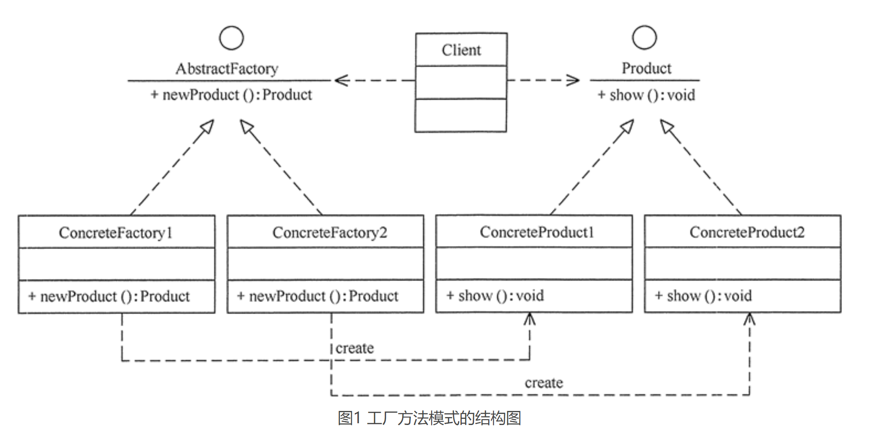

# 工厂模式
工厂模式的定义：定义一个创建产品对象的工厂接口，将产品对象的实际创建工作推迟到具体子工厂类当中。这满足创建型模式中所要求的“创建与使用相分离”的特点。

按实际业务场景划分，工厂模式有 3 种不同的实现方式，分别是简单工厂模式、工厂方法模式和抽象工厂模式。

## 简单工厂模式
我们把被创建的对象称为“产品”，把创建产品的对象称为“工厂”。如果要创建的产品不多，只要一个工厂类就可以完成，这种模式叫“简单工厂模式”。

在简单工厂模式中创建实例的方法通常为静态（static）方法，因此简单工厂模式（Simple Factory Pattern）又叫作静态工厂方法模式（Static Factory Method Pattern）。

简单来说，简单工厂模式有一个具体的工厂类，可以生成多个不同的产品，属于创建型设计模式。简单工厂模式不在 GoF 23 种设计模式之列。

简单工厂模式每增加一个产品就要增加一个具体产品类和一个对应的具体工厂类，这增加了系统的复杂度，违背了“开闭原则”。

### 优点
- 工厂类包含必要的逻辑判断，可以决定在什么时候创建哪一个产品的实例。客户端可以免除直接创建产品对象的职责，很方便的创建出相应的产品。工厂和产品的职责区分明确。
- 客户端无需知道所创建具体产品的类名，只需知道参数即可。
- 也可以引入配置文件，在不修改客户端代码的情况下更换和添加新的具体产品类。

### 缺点
- 简单工厂模式的工厂类单一，负责所有产品的创建，职责过重，一旦异常，整个系统将受影响。且工厂类代码会非常臃肿，违背高聚合原则。
- 使用简单工厂模式会增加系统中类的个数（引入新的工厂类），增加系统的复杂度和理解难度
- 系统扩展困难，一旦增加新产品不得不修改工厂逻辑，在产品类型较多时，可能造成逻辑过于复杂
- 简单工厂模式使用了 static 工厂方法，造成工厂角色无法形成基于继承的等级结构。

### 应用场景
- 工厂类负责创建的对象比较少：由于创建的对象较少，不会造成工厂方法中的业务逻辑太过复杂。
- 客户端只知道传入工厂类的参数，对于如何创建对象不关心：客户端既不需要关心创建细节，甚至连类名都不需要记住，只需要知道类型所对应的参数。

### 总结
简单工厂模式的主要角色如下：
- 简单工厂（SimpleFactory）：是简单工厂模式的核心，负责实现创建所有实例的内部逻辑。工厂类的创建产品类的方法可以被外界直接调用，创建所需的产品对象。
- 抽象产品（Product）：是简单工厂创建的所有对象的父类，负责描述所有实例共有的公共接口。
- 具体产品（ConcreteProduct）：是简单工厂模式的创建目标。

简单工厂模式代码简单，不做额外演示：
```
#include "Factory.h"
#include "ConcreteProductA.h"
#include "ConcreteProductB.h"
Product* Factory::createProduct(string proname){
	if ( "A" == proname )
	{
		return new ConcreteProductA();
	}
	else if("B" == proname)
	{
		return new ConcreteProductB();
	}
	return  NULL;
}
```

简单总结：
- 创建型模式对类的实例化过程进行了抽象，能够将对象的创建与对象的使用过程分离。
- 简单工厂模式又称为静态工厂方法模式，它属于类创建型模式。在简单工厂模式中，可以根据参数的不同返回不同类的实例。简单工厂模式专门定义一个类来负责创建其他类的实例，被创建的实例通常都具有共同的父类。
- 简单工厂模式包含三个角色：工厂角色负责实现创建所有实例的内部逻辑；抽象产品角色是所创建的所有对象的父类，负责描述所有实例所共有的公共接口；具体产品角色是创建目标，所有创建的对象都充当这个角色的某个具体类的实例。
简单工厂模式的要点在于：当你需要什么，只需要传入一个正确的参数，就可以获取你所需要的对象，而无须知道其创建细节。
- 简单工厂模式最大的优点在于实现对象的创建和对象的使用分离，将对象的创建交给专门的工厂类负责，但是其最大的缺点在于工厂类不够灵活，增加新的具体产品需要修改工厂类的判断逻辑代码，而且产品较多时，工厂方法代码将会非常复杂。
- 简单工厂模式适用情况包括：工厂类负责创建的对象比较少；客户端只知道传入工厂类的参数，对于如何创建对象不关心。

## 工厂方法模式


“工厂方法模式”是对简单工厂模式的进一步抽象化，其好处是可以使系统在不修改原来代码的情况下引进新的产品，即满足开闭原则。

父类决定实例的生成方式，但并不决定所要生成具体的类，具体处理全部交给子类处理。
将生成实例的框架与具体的实例类解耦。

### 定义
工厂方法模式(Factory Method Pattern)又称为工厂模式，也叫虚拟构造器(Virtual Constructor)模式或者多态工厂(Polymorphic Factory)模式，它属于类创建型模式。在工厂方法模式中，工厂父类负责定义创建产品对象的公共接口，而工厂子类则负责生成具体的产品对象，这样做的目的是将产品类的实例化操作延迟到工厂子类中完成，即通过工厂子类来确定究竟应该实例化哪一个具体产品类。

### 优点
- 用户只需要知道具体工厂的名称就可得到所要的产品，无须知道产品的具体创建过程。
- 灵活性增强，对于新产品的创建，只需多写一个相应的工厂类。
- 典型的解耦框架。高层模块只需要知道产品的抽象类，无须关心其他实现类，满足迪米特法则、依赖倒置原则和里氏替换原则。

### 缺点
- 类的个数容易过多，增加复杂度
- 增加了系统的抽象性和理解难度
- 抽象产品只能生产一种产品，此弊端可使用抽象工厂模式解决。

### 应用场景
- 客户只知道创建产品的工厂名，而不知道具体的产品名。如 TCL 电视工厂、海信电视工厂等。
- 创建对象的任务由多个具体子工厂中的某一个完成，而抽象工厂只提供创建产品的接口。
- 客户不关心创建产品的细节，只关心产品的品牌

### 总结
工厂方法模式是简单工厂模式的进一步抽象和推广。由于使用了面向对象的多态性，工厂方法模式保持了简单工厂模式的优点，而且克服了它的缺点。在工厂方法模式中，核心的工厂类不再负责所有产品的创建，而是将具体创建工作交给子类去做。这个核心类仅仅负责给出具体工厂必须实现的接口，而不负责哪一个产品类被实例化这种细节，这使得工厂方法模式可以允许系统在不修改工厂角色的情况下引进新产品。

工厂方法模式由抽象工厂、具体工厂、抽象产品和具体产品等4个要素构成。
- 抽象工厂（Abstract Factory）：提供了创建产品的接口，调用者通过它访问具体工厂的工厂方法 newProduct() 来创建产品。
- 具体工厂（ConcreteFactory）：主要是实现抽象工厂中的抽象方法，完成具体产品的创建。
- 抽象产品（Product）：定义了产品的规范，描述了产品的主要特性和功能。
- 具体产品（ConcreteProduct）：实现了抽象产品角色所定义的接口，由具体工厂来创建，它同具体工厂之间一一对应。

简单总结：
- 工厂方法模式又称为工厂模式，它属于类创建型模式。在工厂方法模式中，工厂父类负责定义创建产品对象的公共接口，而工厂子类则负责生成具体的产品对象，这样做的目的是将产品类的实例化操作延迟到工厂子类中完成，即通过工厂子类来确定究竟应该实例化哪一个具体产品类。
- 工厂方法模式包含四个角色：抽象产品是定义产品的接口，是工厂方法模式所创建对象的超类型，即产品对象的共同父类或接口；具体产品实现了抽象产品接口，某种类型的具体产品由专门的具体工厂创建，它们之间往往一一对应；抽象工厂中声明了工厂方法，用于返回一个产品，它是工厂方法模式的核心，任何在模式中创建对象的工厂类都必须实现该接口；具体工厂是抽象工厂类的子类，实现了抽象工厂中定义的工厂方法，并可由客户调用，返回一个具体产品类的实例。
- 工厂方法模式是简单工厂模式的进一步抽象和推广。由于使用了面向对象的多态性，工厂方法模式保持了简单工厂模式的优点，而且克服了它的缺点。在工厂方法模式中，核心的工厂类不再负责所有产品的创建，而是将具体创建工作交给子类去做。这个核心类仅仅负责给出具体工厂必须实现的接口，而不负责产品类被实例化这种细节，这使得工厂方法模式可以允许系统在不修改工厂角色的情况下引进新产品。
- 工厂方法模式的主要优点是增加新的产品类时无须修改现有系统，并封装了产品对象的创建细节，系统具有良好的灵活性和可扩展性；其缺点在于增加新产品的同时需要增加新的工厂，导致系统类的个数成对增加，在一定程度上增加了系统的复杂性。
- 工厂方法模式适用情况包括：一个类不知道它所需要的对象的类；一个类通过其子类来指定创建哪个对象；将创建对象的任务委托给多个工厂子类中的某一个，客户端在使用时可以无须关心是哪一个工厂子类创建产品子类，需要时再动态指定。