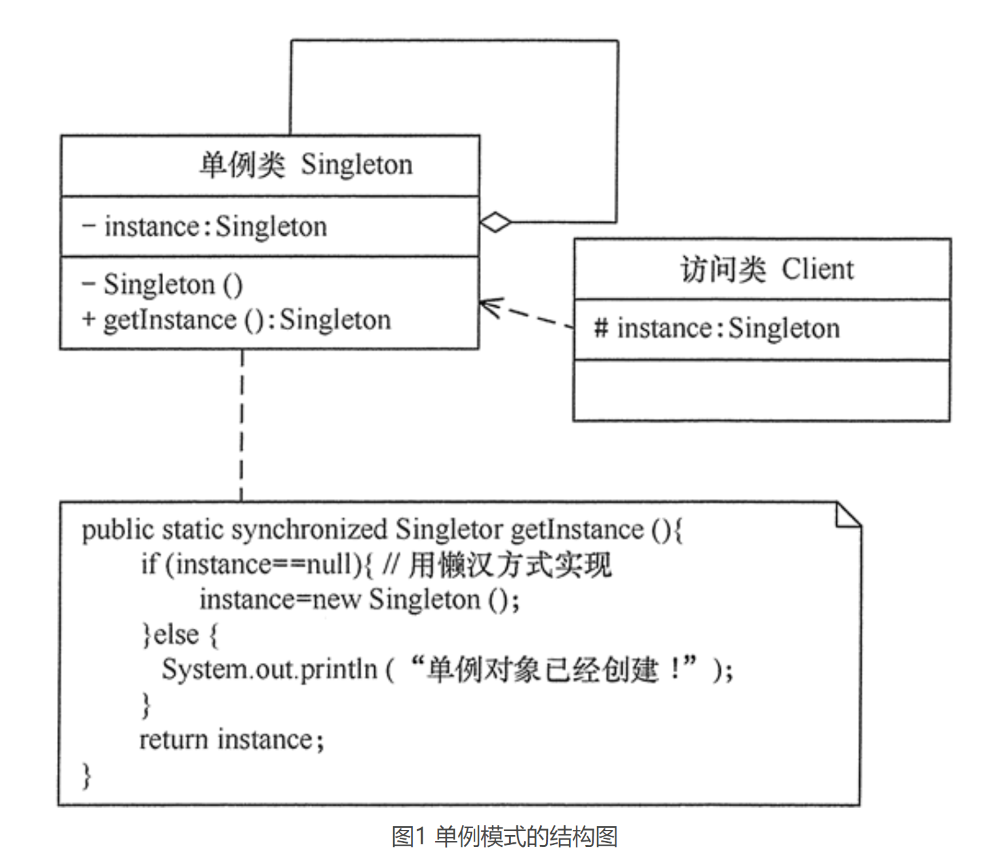

# 单例模式（Singleton）

## 定义
单例模式的定义：单例模式确保某一个类只有一个实例，而且自行实例化并向整个系统提供这个实例，这个类称为单例类，它提供全局访问的方法。

## 优点
- 单例模式可以保证内存里只有一个实例，减少了内存的开销。
- 可以避免对资源的多重占用。
- 单例模式设置全局访问点，可以优化和共享资源的访问。

## 缺点
- 单例模式一般没有接口，扩展困难。如果要扩展，则除了修改原来的代码，没有第二种途径，违背开闭原则。
- 在并发测试中，单例模式不利于代码调试。在调试过程中，如果单例中的代码没有执行完，也不能模拟生成一个新的对象。
- 单例模式的功能代码通常写在一个类中，如果功能设计不合理，则很容易违背单一职责原则。

## 应用场景
- 需要频繁创建的一些类，使用单例可以降低系统的内存压力，减少 GC。
- 某类只要求生成一个对象的时候，如一个班中的班长、每个人的身份证号等。
- 某些类创建实例时占用资源较多，或实例化耗时较长，且经常使用。
- 某类需要频繁实例化，而创建的对象又频繁被销毁的时候，如多线程的线程池、网络连接池等。
- 频繁访问数据库或文件的对象。
- 对于一些控制硬件级别的操作，或者从系统上来讲应当是单一控制逻辑的操作，如果有多个实例，则系统会完全乱套。
- 当对象需要被共享的场合。由于单例模式只允许创建一个对象，共享该对象可以节省内存，并加快对象访问速度。如 Web 中的配置对象、数据库的连接池等。

## 总结
在有些系统中，为了节省内存资源、保证数据内容的一致性，对某些类要求只能创建一个实例，这就是所谓的单例模式。

单例模式的主要角色如下。
- 单例类：包含一个实例且能自行创建这个实例的类。
- 访问类：使用单例的类。

Singleton 模式通常有两种实现形式。
- 懒汉式单例：该模式的特点是类加载时没有生成单例，只有当第一次调用 getlnstance 方法时才去创建这个单例
- 饿汉式单例：该模式的特点是类一旦加载就创建一个单例，保证在调用 getInstance 方法之前单例已经存在了。

单例模式可扩展为有限的多例（Multitcm）模式，这种模式可生成有限个实例，客户需要时可随机获取。

简单总结：
- 单例模式确保某一个类只有一个实例，而且自行实例化并向整个系统提供这个实例，这个类称为单例类，它提供全局访问的方法。单例模式的要点有三个：一是某个类只能有一个实例；二是它必须自行创建这个实例；三是它必须自行向整个系统提供这个实例。单例模式是一种对象创建型模式。
- 单例模式只包含一个单例角色：在单例类的内部实现只生成一个实例，同时它提供一个静态的工厂方法，让客户可以使用它的唯一实例；为了防止在外部对其实例化，将其构造函数设计为私有。
- 单例模式的目的是保证一个类仅有一个实例，并提供一个访问它的全局访问点。单例类拥有一个私有构造函数，确保用户无法通过new关键字直接实例化它。除此之外，该模式中包含一个静态私有成员变量与静态公有的工厂方法。该工厂方法负责检验实例的存在性并实例化自己，然后存储在静态成员变量中，以确保只有一个实例被创建。
- 单例模式的主要优点在于提供了对唯一实例的受控访问并可以节约系统资源；其主要缺点在于因为缺少抽象层而难以扩展，且单例类职责过重。
- 单例模式适用情况包括：系统只需要一个实例对象；客户调用类的单个实例只允许使用一个公共访问点。

