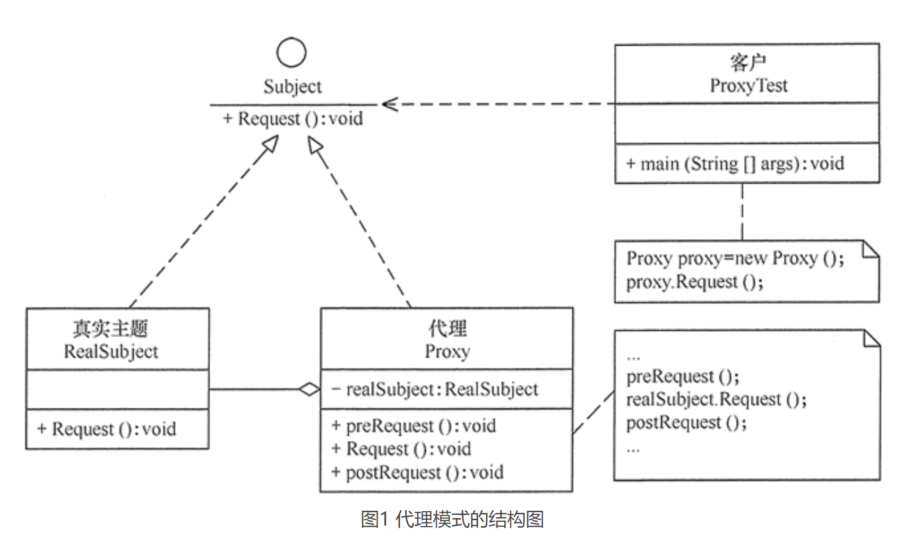
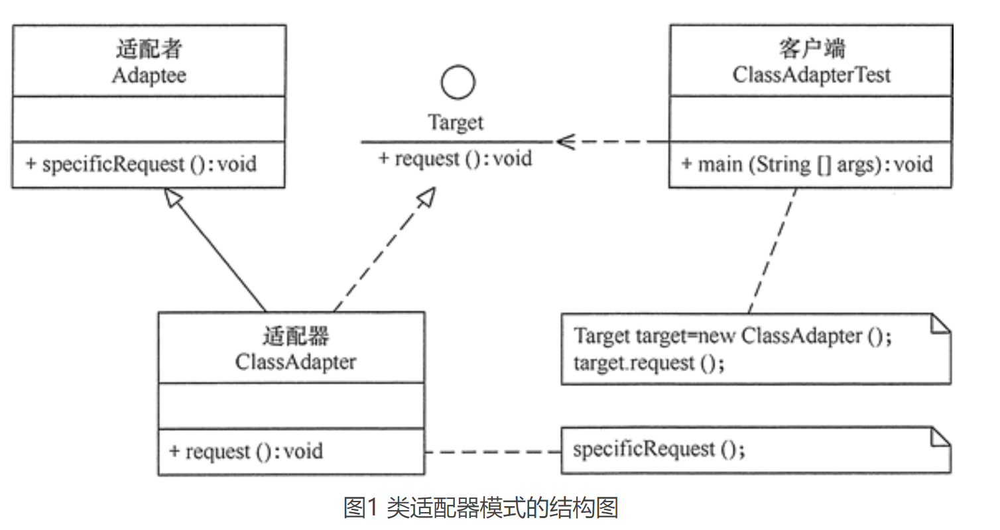

# 适配器模式（Adapter）

## 定义
适配器模式的定义：将一个类的接口转换成客户希望的另外一个接口，使得原本由于接口不兼容而不能一起工作的那些类能一起工作。适配器模式分为类结构型模式和对象结构型模式两种，前者类之间的耦合度比后者高，且要求程序员了解现有组件库中的相关组件的内部结构，所以应用相对较少些。

## 优点
- 客户端通过适配器可以透明地调用目标接口。
- 复用了现存的类，程序员不需要修改原有代码而重用现有的适配者类。
- 将目标类和适配者类解耦，解决了目标类和适配者类接口不一致的问题。
- 在很多业务场景中符合开闭原则。

## 缺点
- 适配器编写过程需要结合业务场景全面考虑，可能会增加系统的复杂性。
- 增加代码阅读难度，降低代码可读性，过多使用适配器会使系统代码变得凌乱。

## 应用场景
适配器模式（Adapter）通常适用于以下场景：
- 以前开发的系统存在满足新系统功能需求的类，但其接口同新系统的接口不一致。
- 使用第三方提供的组件，但组件接口定义和自己要求的接口定义不同。

## 总结
类适配器模式可采用多重继承方式实现，如 C++ 可定义一个适配器类来同时继承当前系统的业务接口和现有组件库中已经存在的组件接口；Java 不支持多继承，但可以定义一个适配器类来实现当前系统的业务接口，同时又继承现有组件库中已经存在的组件。

对象适配器模式可釆用将现有组件库中已经实现的组件引入适配器类中，该类同时实现当前系统的业务接口。

适配器模式（Adapter）包含以下主要角色：
- 目标（Target）接口：当前系统业务所期待的接口，它可以是抽象类或接口。
- 适配者（Adaptee）类：它是被访问和适配的现存组件库中的组件接口。
- 适配器（Adapter）类：它是一个转换器，通过继承或引用适配者的对象，把适配者接口转换成目标接口，让客户按目标接口的格式访问适配者。

## 扩展
适配器模式（Adapter）可扩展为双向适配器模式，双向适配器类既可以把适配者接口转换成目标接口，也可以把目标接口转换成适配者接口。
