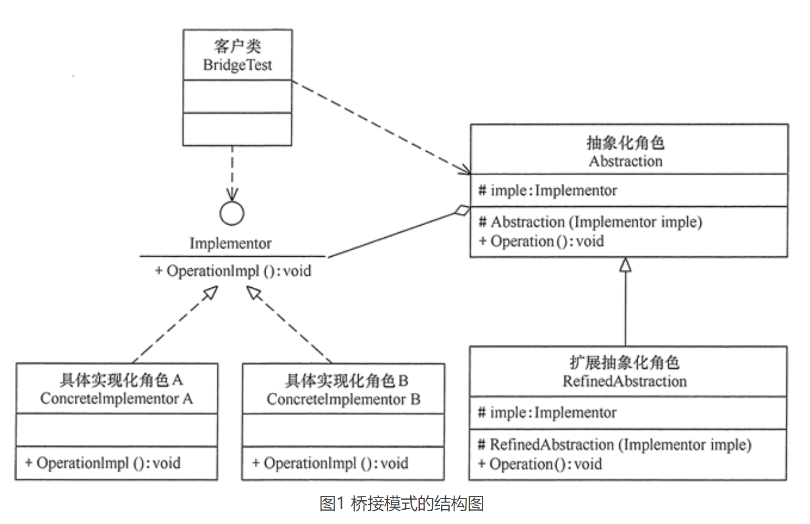

# 桥接模式（Bridge）

## 定义
桥接模式定义：将抽象与实现分离，使它们可以独立变化。它是用组合关系代替继承关系来实现，从而降低了抽象和实现这两个可变维度的耦合度。

## 优点
桥接模式遵循了里氏替换原则和依赖倒置原则，最终实现了开闭原则，对修改关闭，对扩展开放。

桥接（Bridge）模式的优点是：
- 抽象与实现分离，扩展能力强
- 符合开闭原则
- 符合合成复用原则
- 其实现细节对客户透明

## 缺点
- 由于聚合关系建立在抽象层，要求开发者针对抽象化进行设计与编程，能正确地识别出系统中两个独立变化的维度，这增加了系统的理解与设计难度。

## 应用场景
当一个类内部具备两种或多种变化维度时，使用桥接模式可以解耦这些变化的维度，使高层代码架构稳定。

桥接模式通常适用于以下场景。
- 当一个类存在两个独立变化的维度，且这两个维度都需要进行扩展时。
- 当一个系统不希望使用继承或因为多层次继承导致系统类的个数急剧增加时。
- 当一个系统需要在构件的抽象化角色和具体化角色之间增加更多的灵活性时。

桥接模式的一个常见使用场景就是替换继承。我们知道，继承拥有很多优点，比如，抽象、封装、多态等，父类封装共性，子类实现特性。继承可以很好的实现代码复用（封装）的功能，但这也是继承的一大缺点。

因为父类拥有的方法，子类也会继承得到，无论子类需不需要，这说明继承具备强侵入性（父类代码侵入子类），同时会导致子类臃肿。因此，在设计模式中，有一个原则为优先使用组合/聚合，而不是继承。

很多时候，我们分不清该使用继承还是组合/聚合或其他方式等，其实可以从现实语义进行思考。因为软件最终还是提供给现实生活中的人使用的，是服务于人类社会的，软件是具备现实场景的。当我们从纯代码角度无法看清问题时，现实角度可能会提供更加开阔的思路。

## 总结
可以将抽象化部分与实现化部分分开，取消二者的继承关系，改用组合关系。

桥接（Bridge）模式包含以下主要角色：
- 抽象化（Abstraction）角色：定义抽象类，并包含一个对实现化对象的引用。
- 扩展抽象化（Refined Abstraction）角色：是抽象化角色的子类，实现父类中的业务方法，并通过组合关系调用实现化角色中的业务方法。
- 实现化（Implementor）角色：定义实现化角色的接口，供扩展抽象化角色调用。
- 具体实现化（Concrete Implementor）角色：给出实现化角色接口的具体实现。
