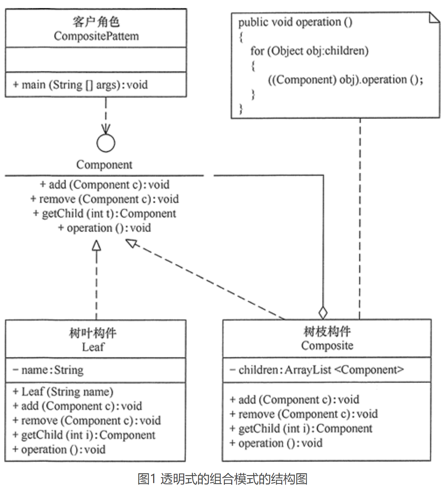
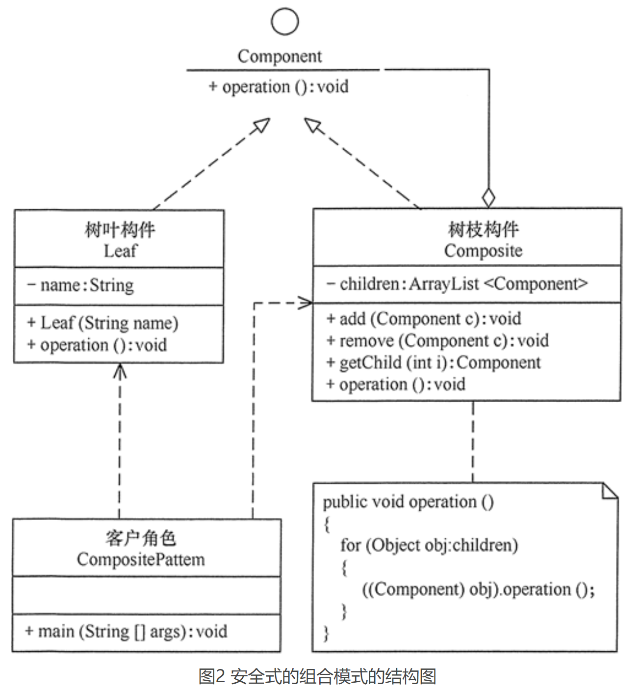

# 组合模式（Composite）

## 定义
组合模式定义：有时又叫作整体-部分（Part-Whole）模式，它是一种将对象组合成树状的层次结构的模式，用来表示“整体-部分”的关系，使用户对单个对象和组合对象具有一致的访问性，属于结构型设计模式。

组合模式一般用来描述整体与部分的关系，它将对象组织到树形结构中，顶层的节点被称为根节点，根节点下面可以包含树枝节点和叶子节点，树枝节点下面又可以包含树枝节点和叶子节点。

其实根节点和树枝节点本质上属于同一种数据类型，可以作为容器使用；而叶子节点与树枝节点在语义上不属于用一种类型。但是在组合模式中，会把树枝节点和叶子节点看作属于同一种数据类型（用统一接口定义），让它们具备一致行为。

这样，在组合模式中，整个树形结构中的对象都属于同一种类型，带来的好处就是用户不需要辨别是树枝节点还是叶子节点，可以直接进行操作，给用户的使用带来极大的便利。
## 优点
- 组合模式使得客户端代码可以一致地处理单个对象和组合对象，无须关心自己处理的是单个对象，还是组合对象，这简化了客户端代码；
- 更容易在组合体内加入新的对象，客户端不会因为加入了新的对象而更改源代码，满足“开闭原则”；

## 缺点
- 设计较复杂，客户端需要花更多时间理清类之间的层次关系；
- 不容易限制容器中的构件；
- 不容易用继承的方法来增加构件的新功能；

## 应用场景
- 在需要表示一个对象整体与部分的层次结构的场合。
- 要求对用户隐藏组合对象与单个对象的不同，用户可以用统一的接口使用组合结构中的所有对象的场合。

## 总结
组合模式包含以下主要角色：
- 抽象构件（Component）角色：它的主要作用是为树叶构件和树枝构件声明公共接口，并实现它们的默认行为。在透明式的组合模式中抽象构件还声明访问和管理子类的接口；在安全式的组合模式中不声明访问和管理子类的接口，管理工作由树枝构件完成。（总的抽象类或接口，定义一些通用的方法，比如新增、删除）
- 树叶构件（Leaf）角色：是组合中的叶节点对象，它没有子节点，用于继承或实现抽象构件。
- 树枝构件（Composite）角色 / 中间构件：是组合中的分支节点对象，它有子节点，用于继承和实现抽象构件。它的主要作用是存储和管理子部件，通常包含 Add()、Remove()、GetChild() 等方法。

组合模式分为透明式的组合模式和安全式的组合模式。
### 透明方式
在该方式中，由于抽象构件声明了所有子类中的全部方法，所以客户端无须区别树叶对象和树枝对象，对客户端来说是透明的。但其缺点是：树叶构件本来没有 Add()、Remove() 及 GetChild() 方法，却要实现它们（空实现或抛异常），这样会带来一些安全性问题。
### 安全方式
在该方式中，将管理子构件的方法移到树枝构件中，抽象构件和树叶构件没有对子对象的管理方法，这样就避免了上一种方式的安全性问题，但由于叶子和分支有不同的接口，客户端在调用时要知道树叶对象和树枝对象的存在，所以失去了透明性。
