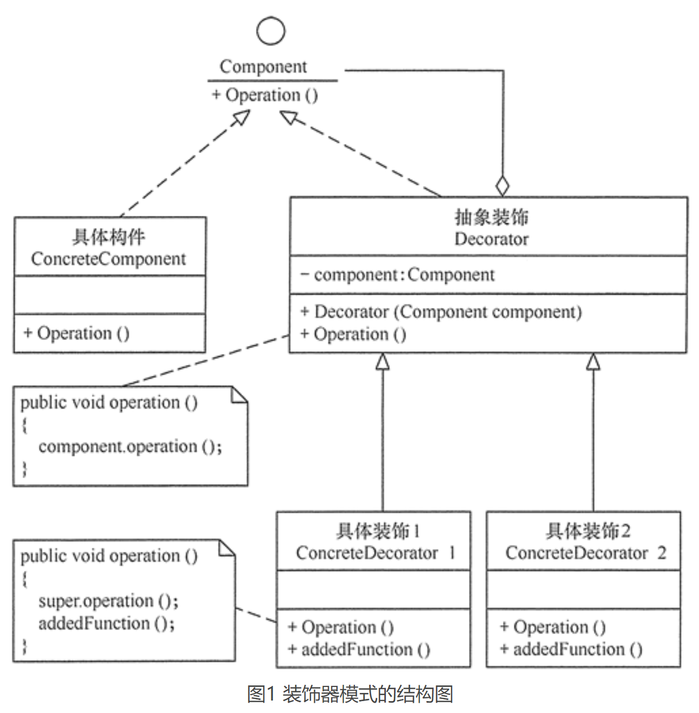

# 装饰器模式（Decorator）

## 定义
装饰器模式定义：指在不改变现有对象结构的情况下，动态地给该对象增加一些职责（即增加其额外功能）的模式，它属于对象结构型模式。

## 优点
- 装饰器是继承的有力补充，比继承灵活，在不改变原有对象的情况下，动态的给一个对象扩展功能，即插即用
- 通过使用不用装饰类及这些装饰类的排列组合，可以实现不同效果
- 装饰器模式完全遵守开闭原则

## 缺点
- 装饰器模式会增加许多子类，过度使用会增加程序得复杂性。

## 应用场景
- 当需要给一个现有类添加附加功能，而又不能采用生成子类的方法进行扩充时。例如，该类被隐藏或者该类是终极类或者采用继承方式会产生大量的子类。
- 当需要通过对现有的一组基本功能进行排列组合而产生非常多的功能时，采用继承关系很难实现，而采用装饰器模式却很好实现。
- 当对象的功能要求可以动态地添加，也可以再动态地撤销时。

装饰器模式在 Java 语言中的最著名的应用莫过于 Java I/O 标准库的设计了。例如，InputStream 的子类 FilterInputStream，OutputStream 的子类 FilterOutputStream，Reader 的子类 BufferedReader 以及 FilterReader，还有 Writer 的子类 BufferedWriter、FilterWriter 以及 PrintWriter 等，它们都是抽象装饰类。

## 总结
通常情况下，扩展一个类的功能会使用继承方式来实现。但继承具有静态特征，耦合度高，并且随着扩展功能的增多，子类会很膨胀。如果使用组合关系来创建一个包装对象（即装饰对象）来包裹真实对象，并在保持真实对象的类结构不变的前提下，为其提供额外的功能，这就是装饰器模式的目标。

装饰器模式主要包含以下角色：
- 抽象构件（Component）角色：定义一个抽象接口以规范构建的功能。
- 具体构件（ConcreteComponent）角色：实现抽象构件定义的功能。
- 抽象装饰（Decorator）角色：继承抽象构件，并包含具体构件的实例，可以通过其子类扩展具体构件的功能。
- 具体装饰（ConcreteDecorator）角色：实现抽象装饰的相关方法，并给具体构件对象添加附加的责任。
