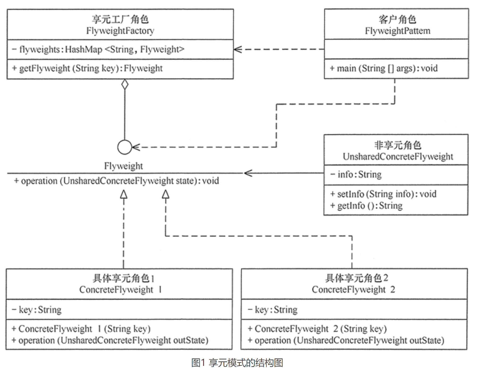

# 享元模式（Flyweight）

## 定义
享元模式定义：运用共享技术来有效地支持大量细粒度对象的复用。它通过共享已经存在的对象来大幅度减少需要创建的对象数量、避免大量相似类的开销，从而提高系统资源的利用率。

## 优点
- 相同对象只要保存一份，这降低了系统中对象的数量，从而降低了系统中细粒度对象给内存带来的压力。

## 缺点
- 为了使对象可以共享，需要将一些不能共享的状态外部化，这将增加程序的复杂性。
- 读取享元模式的外部状态会使得运行时间稍微变长。

## 应用场景
当系统中多处需要同一组信息时，可以把这些信息封装到一个对象中，然后对该对象进行缓存，这样，一个对象就可以提供给多出需要使用的地方，避免大量同一对象的多次创建，降低大量内存空间的消耗。

享元模式其实是工厂方法模式的一个改进机制，享元模式同样要求创建一个或一组对象，并且就是通过工厂方法模式生成对象的，只不过享元模式为工厂方法模式增加了缓存这一功能。

前面分析了享元模式的结构与特点，下面分析它适用的应用场景。享元模式是通过减少内存中对象的数量来节省内存空间的，所以以下几种情形适合采用享元模式。
系统中存在大量相同或相似的对象，这些对象耗费大量的内存资源。
大部分的对象可以按照内部状态进行分组，且可将不同部分外部化，这样每一个组只需保存一个内部状态。
由于享元模式需要额外维护一个保存享元的数据结构，所以应当在有足够多的享元实例时才值得使用享元模式。

## 总结
享元模式的定义提出了两个要求，细粒度和共享对象。因为要求细粒度，所以不可避免地会使对象数量多且性质相近，此时我们就将这些对象的信息分为两个部分：内部状态和外部状态。
- 内部状态指对象共享出来的信息，存储在享元信息内部，并且不回随环境的改变而改变；
- 外部状态指对象得以依赖的一个标记，随环境的改变而改变，不可共享。

比如，连接池中的连接对象，保存在连接对象中的用户名、密码、连接URL等信息，在创建对象的时候就设置好了，不会随环境的改变而改变，这些为内部状态。而当每个连接要被回收利用时，我们需要将它标记为可用状态，这些为外部状态。

享元模式的本质是缓存共享对象，降低内存消耗。

享元模式的主要角色有如下：
- 抽象享元角色（Flyweight）：是所有的具体享元类的基类，为具体享元规范需要实现的公共接口，非享元的外部状态以参数的形式通过方法传入。
- 具体享元（Concrete Flyweight）角色：实现抽象享元角色中所规定的接口。
- 非享元（Unsharable Flyweight)角色：是不可以共享的外部状态，它以参数的形式注入具体享元的相关方法中。
- 享元工厂（Flyweight Factory）角色：负责创建和管理享元角色。当客户对象请求一个享元对象时，享元工厂检査系统中是否存在符合要求的享元对象，如果存在则提供给客户；如果不存在的话，则创建一个新的享元对象。
